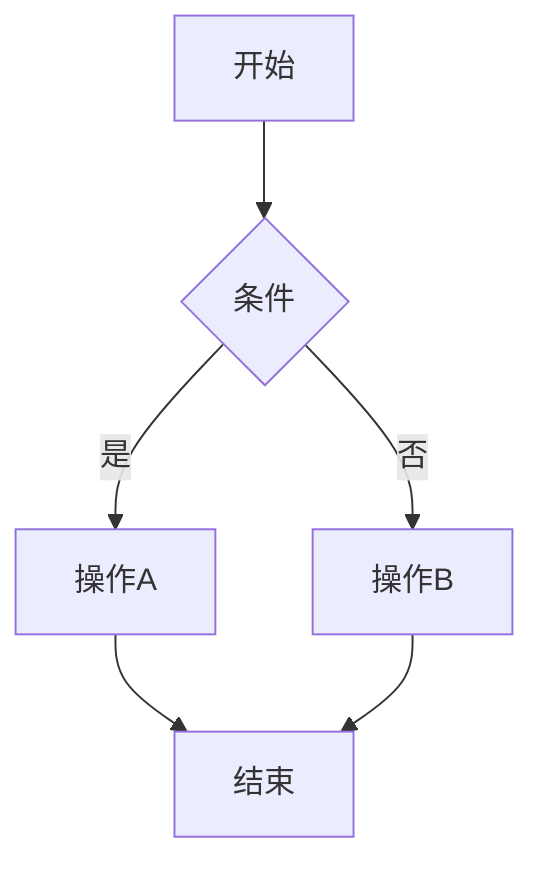
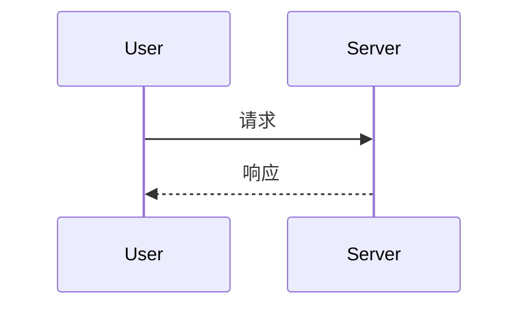
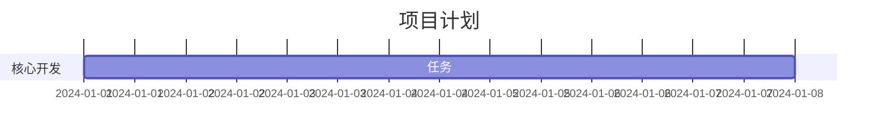
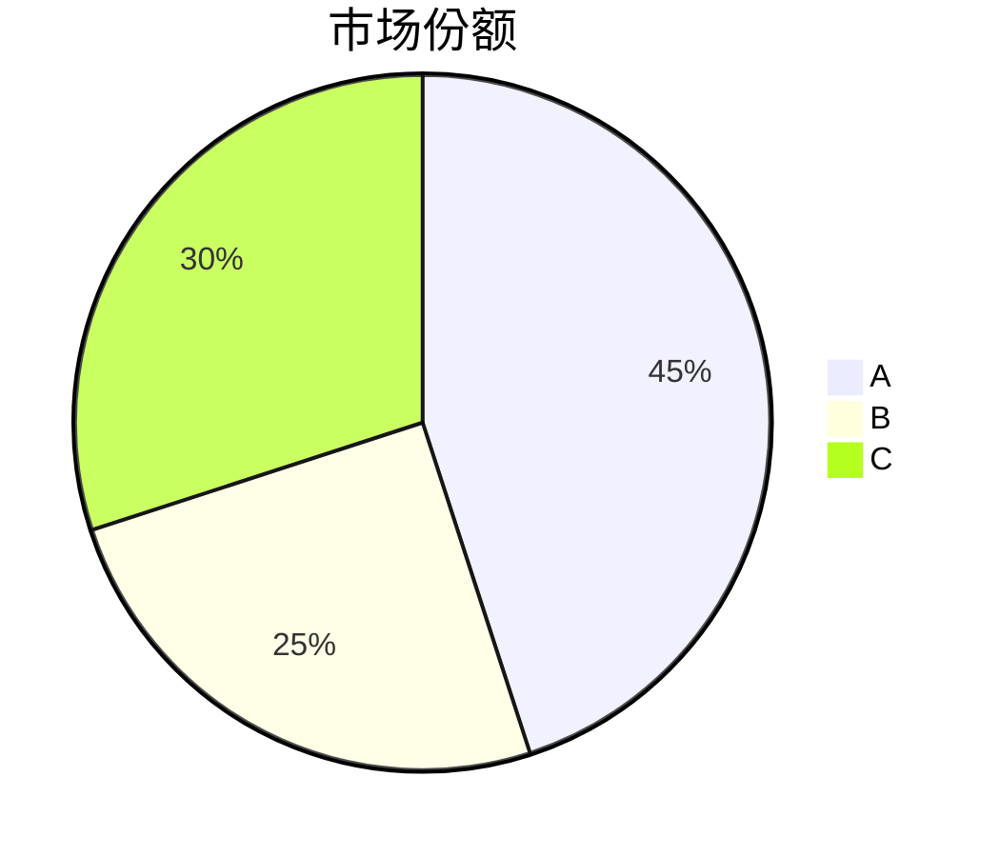
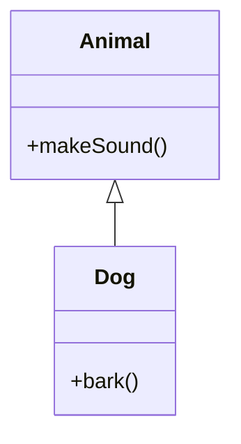
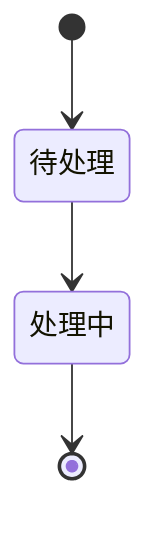
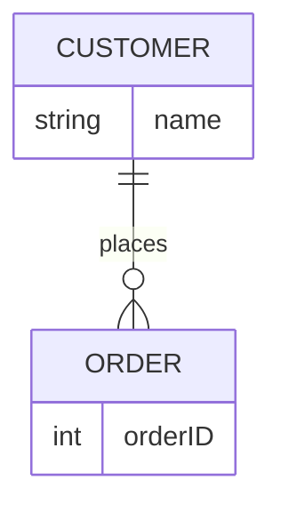
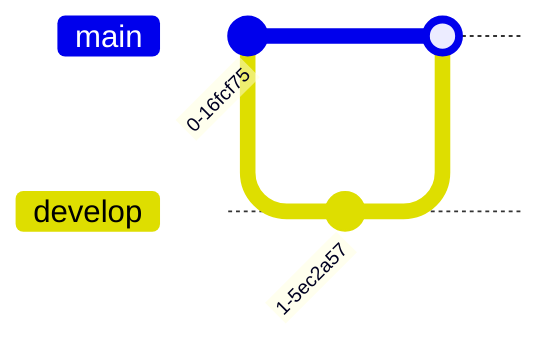
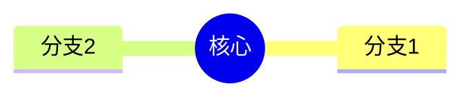

# 图表与流程图测试 (Mermaid)

## 流程图 (Flowchart)

## 时序图 (Sequence Diagram)

## 甘特图 (Gantt Chart)

## 饼图 (Pie Chart)

## 类图 (Class Diagram)

## 状态图 (State Diagram)

## 实体关系图 (ER Diagram)

## Git 图 (Git Graph)

## 思维导图 (Mindmap)

