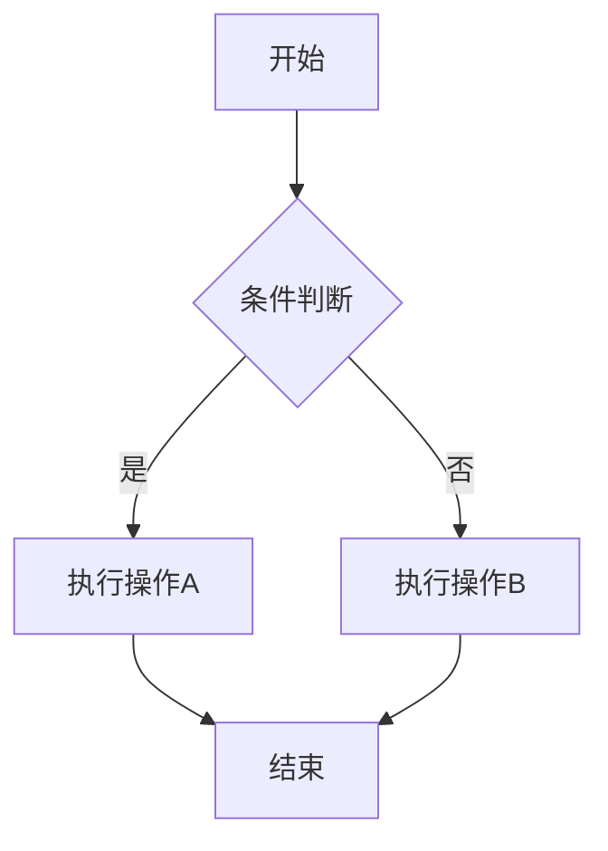
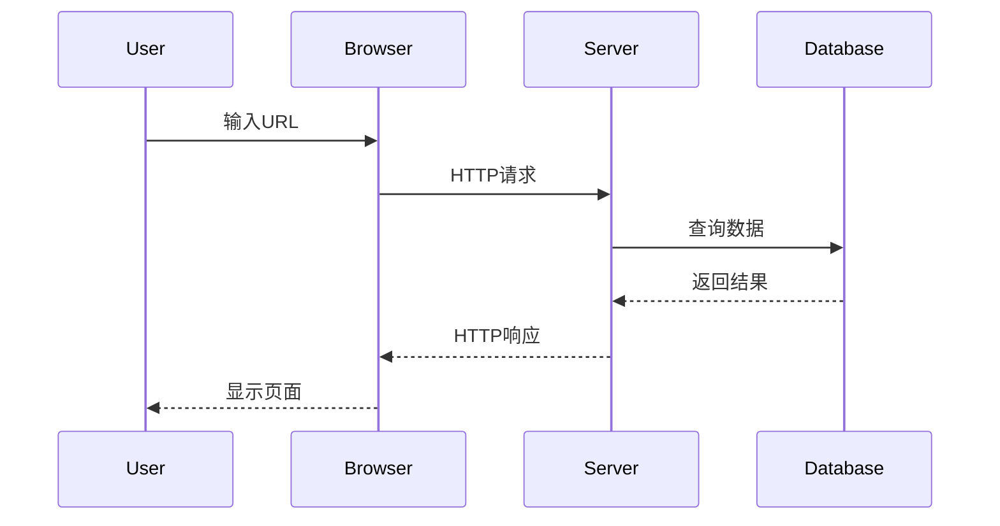
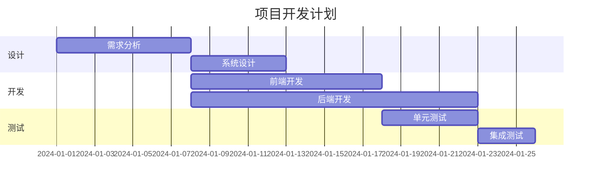

# 一级标题 (H1)
## 二级标题 (H2)
### 三级标题 (H3)
#### 四级标题 (H4)
##### 五级标题 (H5)
###### 六级标题 (H6)

## 列表

### 无序列表

- 列表项 1
- 列表项 2
  - 嵌套列表项 2.1
  - 嵌套列表项 2.2
- 列表项 3

### 有序列表

1. 列表项 1
2. 列表项 2
   1. 嵌套列表项 2.1
   2. 嵌套列表项 2.2
3. 列表项 3

### 任务列表

- [x] 已完成的任务
- [ ] 未完成的任务
- [ ] 待办事项

---

### TypeScript
```typescript
// 接口定义
interface User {
  id: number
  name: string
  email: string
  isActive: boolean
  createdAt: Date
}

// 泛型函数
function createResponse<T>(data: T, message: string = 'Success') {
  return {
    success: true,
    data,
    message,
    timestamp: new Date().toISOString()
  }
}

// 类型守卫
function isString(value: unknown): value is string {
  return typeof value === 'string'
}

// 使用枚举
enum UserRole {
  ADMIN = 'admin',
  USER = 'user',
  MODERATOR = 'moderator'
}

// 类定义
class UserManager {
  private users: User[] = []

  addUser(user: Omit<User, 'id' | 'createdAt'>): User {
    const newUser: User = {
      ...user,
      id: this.users.length + 1,
      createdAt: new Date()
    }
    this.users.push(newUser)
    return newUser
  }

  getActiveUsers(): User[] {
    return this.users.filter(user => user.isActive)
  }
}
```

### Python
```python
# Python 3.9+ 特性
from typing import List, Dict, Optional
from dataclasses import dataclass
from datetime import datetime
import asyncio
import aiohttp

@dataclass
class Product:
    name: str
    price: float
    category: str
    in_stock: bool = True

# 列表推导式
products = [
    Product("Laptop", 999.99, "Electronics"),
    Product("Book", 19.99, "Education"),
]

# 使用列表推导式过滤
electronics = [p for p in products if p.category == "Electronics"]

# 异步函数
async def fetch_product_data(url: str) -> Dict:
    async with aiohttp.ClientSession() as session:
        async with session.get(url) as response:
            return await response.json()

# 使用 asyncio
def main():
    urls = [
        "https://api.example.com/products/1",
        "https://api.example.com/products/2"
    ]

    async def fetch_all():
        tasks = [fetch_product_data(url) for url in urls]
        return await asyncio.gather(*tasks)

    results = asyncio.run(fetch_all())
    print(f"获取了 {len(results)} 个产品")

if __name__ == "__main__":
    main()
```

### Rust
```rust
// Rust 基础语法示例
use std::collections::HashMap;

#[derive(Debug, Clone)]
struct Person {
    name: String,
    age: u32,
    email: Option<String>,
}

impl Person {
    fn new(name: &str, age: u32) -> Self {
        Person {
            name: name.to_string(),
            age,
            email: None,
        }
    }

    fn set_email(&mut self, email: &str) {
        self.email = Some(email.to_string());
    }

    fn can_vote(&self) -> bool {
        self.age >= 18
    }
}

// 泛型函数
fn find_max<T: PartialOrd>(items: &[T]) -> Option<&T> {
    if items.is_empty() {
        return None;
    }

    let mut max = &items[0];
    for item in items.iter().skip(1) {
        if item > max {
            max = item;
        }
    }
    Some(max)
}

// 使用示例
fn main() {
    let mut people = vec![
        Person::new("Alice", 25),
        Person::new("Bob", 17),
        Person::new("Charlie", 30),
    ];

    people[0].set_email("alice@example.com");

    for person in &people {
        println!("{:?} can vote: {}", person, person.can_vote());
    }

    let numbers = vec![3, 1, 4, 1, 5, 9, 2, 6];
    if let Some(max) = find_max(&numbers) {
        println!("最大数字是: {}", max);
    }
}
```

### Java
```java
// Java 17+ 特性示例
import java.util.*;
import java.util.stream.Collectors;
import java.time.LocalDateTime;

public class UserService {

    public record User(String id, String name, String email, LocalDateTime createdAt) {}

    public static class UserManager {
        private final Map<String, User> users = new HashMap<>();

        public User createUser(String name, String email) {
            String id = UUID.randomUUID().toString();
            User user = new User(id, name, email, LocalDateTime.now());
            users.put(id, user);
            return user;
        }

        public List<User> getActiveUsers() {
            return users.values().stream()
                .filter(user -> user.email() != null && !user.email().isEmpty())
                .sorted(Comparator.comparing(User::createdAt))
                .collect(Collectors.toList());
        }

        public Optional<User> findByEmail(String email) {
            return users.values().stream()
                .filter(user -> email.equals(user.email()))
                .findFirst();
        }
    }

    public static void main(String[] args) {
        UserManager manager = new UserManager();

        User alice = manager.createUser("Alice", "alice@example.com");
        User bob = manager.createUser("Bob", "bob@example.com");

        System.out.println("所有用户: " + manager.getActiveUsers());

        manager.findByEmail("alice@example.com")
            .ifPresent(user -> System.out.println("找到用户: " + user.name()));
    }
}
```

### Go
```go
package main

import (
    "fmt"
    "time"
    "sync"
)

// 结构体定义
type Task struct {
    ID        int       `json:"id"`
    Title     string    `json:"title"`
    Completed bool      `json:"completed"`
    CreatedAt time.Time `json:"created_at"`
}

// 接口定义
type TaskRepository interface {
    Create(task Task) (*Task, error)
    GetByID(id int) (*Task, error)
    GetAll() ([]Task, error)
    Update(task Task) (*Task, error)
    Delete(id int) error
}

// 内存实现
type InMemoryTaskRepository struct {
    tasks map[int]Task
    mu    sync.RWMutex
    nextID int
}

func NewInMemoryTaskRepository() *InMemoryTaskRepository {
    return &InMemoryTaskRepository{
        tasks:  make(map[int]Task),
        nextID: 1,
    }
}

func (r *InMemoryTaskRepository) Create(task Task) (*Task, error) {
    r.mu.Lock()
    defer r.mu.Unlock()

    task.ID = r.nextID
    task.CreatedAt = time.Now()
    r.tasks[task.ID] = task
    r.nextID++

    return &task, nil
}

func (r *InMemoryTaskRepository) GetAll() ([]Task, error) {
    r.mu.RLock()
    defer r.mu.RUnlock()

    tasks := make([]Task, 0, len(r.tasks))
    for _, task := range r.tasks {
        tasks = append(tasks, task)
    }
    return tasks, nil
}

func main() {
    repo := NewInMemoryTaskRepository()

    task := Task{
        Title: "学习 Go 语言",
        Completed: false,
    }

    created, err := repo.Create(task)
    if err != nil {
        fmt.Printf("创建任务失败: %v\n", err)
        return
    }

    fmt.Printf("创建任务成功: %+v\n", created)

    tasks, _ := repo.GetAll()
    fmt.Printf("所有任务: %d 个\n", len(tasks))
}
```

### SQL
```sql
-- 现代 SQL 示例 (PostgreSQL)
-- 创建表
CREATE TABLE users (
    id SERIAL PRIMARY KEY,
    username VARCHAR(50) UNIQUE NOT NULL,
    email VARCHAR(255) UNIQUE NOT NULL,
    full_name VARCHAR(100),
    created_at TIMESTAMP WITH TIME ZONE DEFAULT CURRENT_TIMESTAMP,
    updated_at TIMESTAMP WITH TIME ZONE DEFAULT CURRENT_TIMESTAMP,
    is_active BOOLEAN DEFAULT TRUE,
    metadata JSONB DEFAULT '{}'::jsonb
);

-- 创建索引
CREATE INDEX idx_users_email ON users(email);
CREATE INDEX idx_users_created_at ON users(created_at);
CREATE INDEX idx_users_metadata ON users USING GIN (metadata);

-- 插入数据
INSERT INTO users (username, email, full_name, metadata) VALUES
('alice', 'alice@example.com', 'Alice Johnson', '{"preferences": {"theme": "dark", "notifications": true}}'),
('bob', 'bob@example.com', 'Bob Smith', '{"preferences": {"theme": "light", "notifications": false}}');

-- 查询示例
SELECT
    u.id,
    u.username,
    u.email,
    u.full_name,
    u.metadata->>'preferences' as preferences,
    (u.metadata->'preferences'->>'notifications')::boolean as notifications_enabled,
    EXTRACT(DAYS FROM (CURRENT_TIMESTAMP - u.created_at)) as days_since_creation
FROM users u
WHERE u.is_active = TRUE
    AND u.created_at > CURRENT_TIMESTAMP - INTERVAL '30 days'
ORDER BY u.created_at DESC
LIMIT 10;

-- 使用 CTE (公共表表达式)
WITH active_users AS (
    SELECT * FROM users WHERE is_active = TRUE
),
user_stats AS (
    SELECT
        COUNT(*) as total_users,
        COUNT(CASE WHEN metadata->'preferences'->>'theme' = 'dark' THEN 1 END) as dark_theme_users
    FROM active_users
)
SELECT * FROM user_stats;

-- 更新触发器
CREATE OR REPLACE FUNCTION update_updated_at_column()
RETURNS TRIGGER AS $$
BEGIN
    NEW.updated_at = CURRENT_TIMESTAMP;
    RETURN NEW;
END;
$$ language 'plpgsql';

CREATE TRIGGER update_users_updated_at BEFORE UPDATE ON users
    FOR EACH ROW EXECUTE FUNCTION update_updated_at_column();
```

## 8. 数学公式

### 行内公式
勾股定理：$a^2 + b^2 = c^2$

### 块级公式
$$
\int_{-\infty}^{\infty} e^{-x^2} dx = \sqrt{\pi}
$$

### 复杂公式
$$
\begin{align}
\nabla \times \vec{E} &= -\frac{\partial \vec{B}}{\partial t} \\
\nabla \times \vec{H} &= \vec{J} + \frac{\partial \vec{D}}{\partial t} \\
\nabla \cdot \vec{D} &= \rho \\
\nabla \cdot \vec{B} &= 0
\end{align}
$$

## 9. 流程图和图表

### Mermaid 流程图


### Mermaid 时序图


### Mermaid 甘特图


## 10. 折叠内容

<details>
<summary>点击展开查看详细信息</summary>

这是一个可折叠的内容区域。

- 可以包含列表
- 可以包含代码
- 可以包含任何 Markdown 内容

```javascript
console.log('这是折叠区域内的代码')
```

</details>

## 11. 脚注

这是一个有脚注的句子[^1]。

另一个脚注示例[^2]。

[^1]: 这是第一个脚注的内容。
[^2]: 这是第二个脚注的内容，可以包含 [链接](https://example.com)。

## 12. 定义列表

术语 1
: 这是术语 1 的定义

术语 2
: 这是术语 2 的定义
: 可以有多个定义

术语 3
: 这是术语 3 的定义
  可以跨多行

## 13. Emoji 和特殊符号

### Emoji
😀 😃 😄 😁 😆 😅 😂 🤣 🥲 ☺️ 😊 😇 🙂

### 数学符号
α β γ δ ε ζ η θ ι κ λ μ ν ξ ο π ρ σ τ υ φ χ ψ ω

### 货币符号
$ € £ ¥ ₹ ₽

### 箭头符号
→ ← ↑ ↓ ↔ ↕ ↗ ↘ ↙ ↖

## 14. HTML 内嵌

<div style="background-color: #f0f0f0; padding: 1rem; border-radius: 4px; margin: 1rem 0;">
  <h3>自定义 HTML 块</h3>
  <p>这是一个使用内嵌 HTML 创建的自定义块。</p>
  <button onclick="alert('Hello from Markdown!')">点击我</button>
</div>

## 15. 注释

<!-- 这是一个注释，不会在预览中显示 -->

这是一个可见的文本。

---
## 5. 图片

### 普通图片


### 带链接的图片
[](https://code.visualstudio.com)

### 不同尺寸的图片


### 公开图片示例（可传宽高）


### HTTP 图片示例


## 6. 表格

### 基础表格
| 姓名 | 年龄 | 城市 |
|------|------|------|
| 张三 | 25   | 北京 |
| 李四 | 30   | 上海 |
| 王五 | 28   | 广州 |

### 对齐表格
| 左对齐 | 居中对齐 | 右对齐 |
|:-------|:--------:|-------:|
| 文本1  | 文本2    | 文本3  |
| 左     | 中      | 右     |

### 复杂表格
| 功能 | 状态 | 备注 |
|------|------|------|
| 用户认证 | ✅ | JWT 实现 |
| 支付集成 | 🔄 | 开发中 |
| 数据分析 | ❌ | 计划中 |
