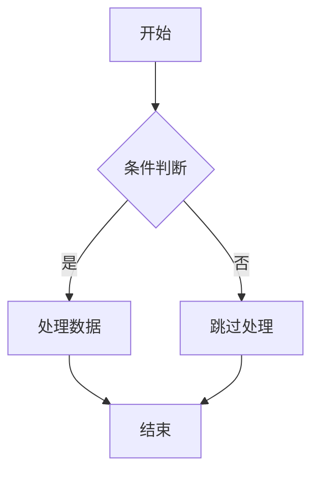

这里才是文章的正文...

# 引用和折叠内容测试

## 1. 基础引用

### 简单引用
> 这是一个简单的引用块。

### 多行引用
> 这是第一行引用文本。
> 这是第二行引用文本。
> 这是第三行引用文本。

### 嵌套引用
> 这是外层引用
>
> > 这是内层引用
> > 内层引用的第二行
>
> 回到外层引用

## 2. 引用中的其他元素

### 引用中的列表
> 引用中的无序列表：
> - 列表项 1
> - 列表项 2
>   - 嵌套列表项
> - 列表项 3
>
> 引用中的有序列表：
> 1. 有序列表项 1
> 2. 有序列表项 2

### 引用中的代码
> 引用中的行内代码：`console.log('Hello World')`
>
> 引用中的代码块：
> ```javascript
> function greet(name) {
>   return `Hello, ${name}!`
> }
> ```

### 引用中的链接
> 这是一个包含[链接](https://github.com)的引用。
>

## 3. 特殊引用格式

### 带标题的引用
> **引用标题**
>
> 这是引用的内容部分，可以包含各种 Markdown 元素。

### 引用中的表格
> 引用中的表格示例：
>
> | 姓名 | 年龄 | 城市 |
> |------|------|------|
> | 张三 | 25   | 北京 |
> | 李四 | 30   | 上海 |

### 引用中的数学公式
> 引用中的行内公式：$E = mc^2$
>
> 引用中的块级公式：
> $$
> \int_{a}^{b} f(x) dx = F(b) - F(a)
> $$

## 4. :::details 折叠测试

### 基础折叠
:::details 点击展开基础内容
这是折叠区域内的基础内容。
可以包含文本、链接等基本元素。
:::

### 带标题的折叠
:::details 高级配置选项
这里是一些高级配置选项的详细说明：

- 选项 1：启用功能 A
- 选项 2：禁用功能 B
- 选项 3：自定义设置 C

更多详细信息请参考文档。
:::

### 折叠中的代码
:::details 代码示例
```javascript
// 折叠区域中的 JavaScript 代码
function calculateSum(a, b) {
  return a + b
}

const result = calculateSum(5, 3)
console.log(result) // 输出: 8
```

```python
# 折叠区域中的 Python 代码
def fibonacci(n):
    if n <= 1:
        return n
    return fibonacci(n-1) + fibonacci(n-2)

print(fibonacci(10))  # 输出: 55
```
:::

### 折叠中的列表和表格
<details>
  <summary>点击展开</summary>
  <p>这里是需要被折叠的详细内容。</p>
</details>
:::tip
这是一个提示容器。
:::

:::danger
这是一个危险警告！
:::
:::details 数据结构示例
#### 列表示例
- 前端技术栈
  - HTML
  - CSS
  - JavaScript
  - React/Vue/Angular
- 后端技术栈
  - Node.js
  - Python
  - Java
  - Go

#### 表格示例
| 技术 | 类型 | 难度 |
|------|------|------|
| React | 前端 | 中等 |
| Node.js | 后端 | 中等 |
| Python | 后端 | 简单 |
| Go | 后端 | 困难 |
:::

### 嵌套折叠
:::details 外层折叠内容
这是外层折叠的内容。

:::details 内层折叠内容
这是内层折叠的内容，可以进一步隐藏详细信息。

- 内层列表项 1
- 内层列表项 2

```css
/* 内层折叠中的 CSS */
.nested-content {
  padding: 10px;
  margin: 5px 0;
  border-left: 3px solid #ccc;
}
```
:::

外层折叠的结尾部分。
:::

### 折叠中的引用
:::details 引用示例
> 这是折叠区域内的引用块。
>
> > 可以包含嵌套引用
>
> 引用可以与其他元素混合使用。
:::

### 折叠中的数学公式和图表
:::details 数学和图表
#### 数学公式
行内公式：$a^2 + b^2 = c^2$

块级公式：
$$
f(x) = \int_{-\infty}^{\infty} \hat{f}(\xi) e^{2 \pi i \xi x} d\xi
$$

#### Mermaid 图表

:::

### 复杂折叠内容
:::details 综合示例
这个折叠区域展示了多种 Markdown 元素的组合使用。

#### 文本格式
**粗体文本**、*斜体文本*、~~删除线~~、`行内代码`

#### 混合内容
> 引用块中的[链接](https://example.com)和图片：
> 

#### 代码和公式
```bash
echo "Hello from folded content"
```

数学公式：$\sum_{i=1}^{n} i = \frac{n(n+1)}{2}$

#### 列表和表格
1. 第一项
2. 第二项
   - 子项 A
   - 子项 B

| 列1 | 列2 | 列3 |
|-----|-----|-----|
| A   | B   | C   |
| D   | E   | F   |

#### HTML 内容
<div style="background-color: #f5f5f5; padding: 10px; border-radius: 4px;">
  <p>这是一个自定义样式的 HTML 块</p>
</div>
:::

## 5. 引用和折叠的组合使用

### 引用中的折叠
> 引用中可以包含折叠内容：
>
> :::details 引用内的折叠
> 这是位于引用块内部的折叠区域。
>
> - 列表项 1
> - 列表项 2
>
> ```javascript
> console.log('引用中的折叠代码')
> ```
> :::
>
> 引用继续...

### 折叠中的引用
:::details 折叠中的引用
这个折叠区域包含了引用块：

> 这是折叠区域内的第一层引用
>
> > 这是折叠区域内的第二层引用
> > 可以包含各种 Markdown 元素
>
> 回到第一层引用

折叠区域的其他内容...
:::
